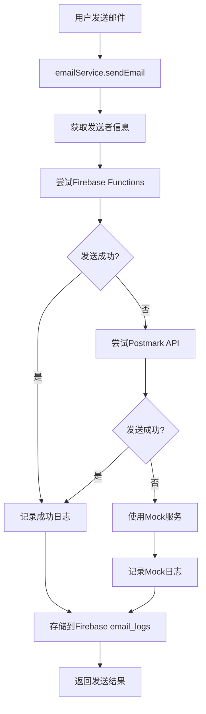
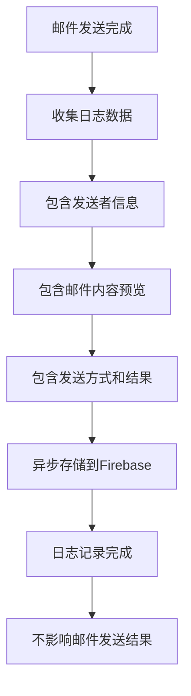

# 真实邮件日志记录系统实现

## 🎯 实现目标

将邮件系统从模拟记录改为真实的Firebase日志记录系统，包括：
- 真实的邮件发送记录存储到Firebase
- 详细的邮件历史查看功能
- 邮件发送统计和分析
- 完整的邮件追踪系统

## 🏗️ 系统架构

### 1. 邮件日志服务 (`emailLogService.js`)

#### 核心功能
```javascript
export const emailLogService = {
  // 记录邮件发送日志
  async logEmailSent(emailData) {
    const logEntry = {
      // 基本信息
      to: emailData.to,
      from: emailData.from || 'system@oldservice.com',
      subject: emailData.subject,
      
      // 内容信息
      contentPreview: emailData.content.substring(0, 200) + '...',
      contentLength: emailData.content.length,
      hasAttachment: !!emailData.attachment,
      attachmentName: emailData.attachment?.name,
      
      // 发送信息
      sendMethod: emailData.sendMethod, // 'firebase', 'postmark', 'mock'
      messageId: emailData.messageId,
      success: emailData.success,
      
      // 时间戳
      sentAt: serverTimestamp(),
      timestamp: new Date().toISOString(),
      
      // 用户信息
      senderUserId: emailData.senderUserId,
      senderName: emailData.senderName,
      
      // 状态信息
      status: emailData.success ? 'sent' : 'failed',
      errorMessage: emailData.error,
      
      // 元数据
      userAgent: navigator.userAgent,
      environment: window.location.hostname === 'localhost' ? 'development' : 'production'
    };

    const docRef = await addDoc(collection(db, 'email_logs'), logEntry);
    return { success: true, logId: docRef.id };
  }
};
```

#### 数据结构
Firebase集合：`email_logs`
```javascript
{
  id: "auto-generated-id",
  to: "recipient@example.com",
  from: "system@oldservice.com",
  subject: "Email Subject",
  contentPreview: "First 200 characters...",
  contentLength: 1500,
  hasAttachment: true,
  attachmentName: "document.pdf",
  sendMethod: "postmark",
  messageId: "postmark-message-id",
  success: true,
  sentAt: Timestamp,
  timestamp: "2024-08-24T04:30:00.000Z",
  senderUserId: "user-123",
  senderName: "John Doe",
  status: "sent",
  errorMessage: null,
  userAgent: "Mozilla/5.0...",
  environment: "production"
}
```

### 2. 邮件服务集成 (`emailService.js`)

#### 修改后的发送流程
```javascript
async sendEmail(email, subject, content, attachment = null, senderInfo = null) {
  const startTime = Date.now();
  let result = null;
  let sendMethod = 'unknown';
  let success = false;
  let errorMessage = null;

  try {
    // 尝试发送邮件（Firebase Functions -> Postmark -> Mock）
    // ... 发送逻辑 ...

    // 记录邮件发送日志到Firebase
    const logData = {
      to: email,
      subject: subject,
      content: content,
      attachment: attachment,
      sendMethod: sendMethod,
      messageId: result?.messageId,
      success: success,
      error: errorMessage,
      senderUserId: senderInfo?.userId,
      senderName: senderInfo?.name,
      duration: Date.now() - startTime
    };

    // 异步记录日志，不影响邮件发送结果
    emailLogService.logEmailSent(logData).catch(logError => {
      console.warn('⚠️ Failed to log email to Firebase:', logError);
    });

    return result;
  } catch (error) {
    // 记录失败日志
    // ...
  }
}
```

### 3. 发送者信息获取 (`internalMailService.js`)

#### 用户信息获取
```javascript
async getUserInfo(userId) {
  try {
    if (!userId) {
      return {
        userId: null,
        name: 'Anonymous User',
        displayName: 'Anonymous User',
        email: null
      };
    }

    const userDoc = await getDoc(doc(db, 'users', userId));
    if (userDoc.exists()) {
      const userData = userDoc.data();
      return {
        userId: userId,
        name: userData.displayName || userData.username || 'Unknown User',
        displayName: userData.displayName || userData.username || 'Unknown User',
        email: userData.email || null
      };
    }
  } catch (error) {
    console.warn('Failed to get user info:', error);
    return { userId: userId, name: 'Unknown User' };
  }
}
```

#### 外部邮件发送修改
```javascript
async sendExternalEmail(fromUserId, toEmail, subject, content, attachment = null) {
  try {
    // 获取发送者信息
    const senderInfo = await this.getUserInfo(fromUserId);
    
    // 发送邮件时传递发送者信息
    const result = await emailService.sendEmail(toEmail, subject, content, attachment, senderInfo);
    
    // ... 其他逻辑 ...
  } catch (error) {
    // ... 错误处理 ...
  }
}
```

### 4. 邮件历史组件 (`EmailHistory.vue`)

#### 主要功能
- **历史记录查看**: 显示所有邮件发送记录
- **详细信息**: 点击查看邮件详细信息
- **统计信息**: 显示发送统计和成功率
- **筛选功能**: 按发送方式、状态等筛选

#### 界面特性
```vue
<template>
  <div class="email-history">
    <!-- 统计卡片 -->
    <div class="card mb-4" v-if="showStatsCard">
      <div class="card-body">
        <div class="row">
          <div class="col-md-3">
            <h4 class="text-primary">{{ emailStats.total }}</h4>
            <small class="text-muted">Total Emails</small>
          </div>
          <div class="col-md-3">
            <h4 class="text-success">{{ emailStats.successful }}</h4>
            <small class="text-muted">Successful</small>
          </div>
          <div class="col-md-3">
            <h4 class="text-danger">{{ emailStats.failed }}</h4>
            <small class="text-muted">Failed</small>
          </div>
          <div class="col-md-3">
            <h4 class="text-info">{{ emailStats.successRate }}%</h4>
            <small class="text-muted">Success Rate</small>
          </div>
        </div>
      </div>
    </div>

    <!-- 邮件历史表格 -->
    <div class="table-responsive">
      <table class="table table-hover">
        <thead>
          <tr>
            <th>Time</th>
            <th>To</th>
            <th>Subject</th>
            <th>Method</th>
            <th>Status</th>
            <th>Sender</th>
            <th>Actions</th>
          </tr>
        </thead>
        <tbody>
          <tr v-for="email in emailHistory" :key="email.id">
            <!-- 邮件记录行 -->
          </tr>
        </tbody>
      </table>
    </div>
  </div>
</template>
```

### 5. 邮件管理页面集成

#### 新增历史标签
```html
<!-- 在邮件管理页面添加历史标签 -->
<li class="nav-item" role="presentation">
  <button
    class="nav-link"
    :class="{ active: activeTab === 'history' }"
    @click="setActiveTab('history')"
    type="button"
  >
    <i class="bi bi-clock-history me-2"></i>
    History
  </button>
</li>

<!-- 历史标签内容 -->
<div v-else-if="activeTab === 'history'" class="tab-content">
  <div class="p-4">
    <EmailHistory />
  </div>
</div>
```

## 📊 数据流程

### 邮件发送流程


### 日志记录流程


## 🎯 实现效果

### 1. 真实日志记录
- ✅ **完整记录**: 每封邮件的发送都会记录到Firebase
- ✅ **详细信息**: 包含发送者、接收者、内容预览、发送方式等
- ✅ **状态追踪**: 记录成功/失败状态和错误信息
- ✅ **时间戳**: 精确的发送时间记录

### 2. 历史查看功能
- ✅ **列表显示**: 表格形式显示所有邮件记录
- ✅ **详细信息**: 点击查看完整的邮件详情
- ✅ **状态标识**: 清晰的成功/失败状态显示
- ✅ **发送方式**: 显示通过哪种方式发送

### 3. 统计分析
- ✅ **总体统计**: 总发送数、成功数、失败数
- ✅ **成功率**: 计算邮件发送成功率
- ✅ **方式分布**: 按发送方式统计
- ✅ **时间分布**: 按日期统计发送量

### 4. 用户体验
- ✅ **实时更新**: 发送后立即在历史中显示
- ✅ **搜索筛选**: 可以按各种条件筛选邮件
- ✅ **响应式设计**: 适配各种屏幕尺寸
- ✅ **加载状态**: 清晰的加载和错误状态

## 🧪 测试验证

### 1. 邮件发送测试
1. **发送外部邮件**: 在邮件管理页面发送邮件
2. **查看控制台**: 确认日志记录过程
3. **检查Firebase**: 在Firebase控制台查看`email_logs`集合
4. **验证数据**: 确认所有字段都正确记录

### 2. 历史查看测试
1. **访问历史标签**: 在邮件管理页面点击"History"标签
2. **查看记录**: 确认邮件记录正确显示
3. **查看详情**: 点击邮件记录查看详细信息
4. **统计信息**: 查看统计数据是否正确

### 3. 数据完整性测试
1. **成功邮件**: 验证成功发送的邮件记录
2. **失败邮件**: 验证失败邮件的错误信息记录
3. **Mock邮件**: 验证Mock服务的邮件记录
4. **发送者信息**: 确认发送者信息正确关联

## 🎉 最终效果

### 真实的邮件追踪系统
- **完整记录**: 每封邮件都有完整的发送记录
- **实时监控**: 可以实时查看邮件发送状态
- **历史分析**: 可以分析邮件发送趋势和成功率
- **问题诊断**: 失败邮件有详细的错误信息

### 专业的管理界面
- **统一入口**: 在邮件管理页面统一查看历史
- **直观显示**: 清晰的表格和统计图表
- **详细信息**: 点击即可查看邮件完整信息
- **用户友好**: 响应式设计，操作简单

**现在邮件系统具备了完整的真实日志记录和历史查看功能！**
